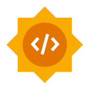

# Welcome to GSoC 2026

For contributors and mentors

Community bonding kickoff for our summer projects

---

## Welcome 🎉

- We received **100+ proposals** this year
- Congratulations to all selected contributors and mentors
- Thank you for the time, care, and effort it took to get here
- Wishing everyone a great and successful project this summer

---

## What we want from community bonding

- Build real connections, not just task lists
- Get local setup, docs, and access sorted out before coding day one
- Agree on communication rhythm and expectations
- Understand how each project fits the community
- Make it easy to ask questions early and often

> The goal is not just to start coding. It is to start **well**.

---

## Meet the cohort

| Project | Contributor | Mentors |
| --- | --- | --- |
| Automated Clinical Metadata Harmonization Dashboard | Ahmed Osama | Angelica, Sehyun Oh |
| AI-Assisted Curation Assistant Tool | Filippo Cingolani | Ramya Madupuri |
| Enhance Similarity Maps Visualization | Leslie Ejeh | inodb, Jason Hwee |
| MCP Apps: Interactive Genomic Visualisations | Luke Devlin | Zain Nasir |
| Enhance 3D Protein Structure Viewer | Yichuan Zhang | Onur Sumer, Xiang Li |

---

## How we will work together

- Contributors and mentors should stay in regular contact during bonding
- Aim for **2+ touchpoints each week** early on
- Keep at least **one live 1:1 or check-in each week**
- Use **#gsoc-2026-contributors** for cross-project discussion and shared questions
- Use project channels for project-specific details and day-to-day technical discussion
- If you are blocked, confused, or waiting on access, say it early
- This is **not a competition anymore**; collaborate and help each other

---

## Slack channels

- **#gsoc-2026-contributors** — cohort-wide discussion across projects
- **#gsoc-2026-ai-curation-assistant**
- **#gsoc-2026-mcp-genomic-vis**
- **#gsoc-2026-metadata-harmonization**
- **#gsoc-2026-protein-structure-viewer**
- **#gsoc-2026-similarity-maps**

---

## What we expect from contributors

- Be responsive and communicate consistently
- Read the docs and start getting comfortable with the codebase
- Confirm your environment works before coding begins
- Bring questions, ideas, and concerns to your mentors
- Take ownership of your project and your growth in the community

---

## What we expect from mentors

- Be welcoming, reachable, and proactive
- Help contributors understand the bigger picture, not only the task list
- Make sure setup and onboarding do not become hidden blockers
- Give feedback early and clearly
- Help contributors feel visible, heard, and included

---

## Important timeline

| Date | Milestone |
| --- | --- |
| **Apr 30** | Accepted GSoC projects announced |
| **May 1 - 24** | **Community bonding period (our focus right now)** |
| **May 25** | Coding officially begins |
| **Jul 6 - Jul 10** | Midterm evaluation window for standard projects |
| **Aug 17 - Aug 31** | Final submission and mentor evaluation window for standard projects |
| **Nov 2 - Nov 9** | Final deadlines for extended projects |

**Right now:** use this period to connect, get set up, and define the first milestones.

---

## Important reminders

- If project length needs to change, discuss it **before** any official update
- Project size can be reduced if needed, but not increased
- Long silence during bonding is a serious problem; communicate early

---

## What success looks like by May 25

- You know who to talk to
- Your tooling and local setup are working
- Your first milestones are clear
- Your communication rhythm is established
- You feel like part of the community, not isolated in a project

---

## Beyond the coding period

- We want contributors to stay connected after GSoC too
- Presentations, demos, and documentation all matter
- Visibility and ownership help projects live on
- Great contributors often become long-term community members and future mentors

---

## Next steps

1. Confirm communication channels and first recurring meetings
2. Join **#gsoc-2026-contributors** and the right project-specific Slack channel
3. Define the first small, concrete onboarding tasks
4. Make sure every contributor has the repos, docs, and access they need
5. Keep asking questions and getting to know the community

---

# Welcome again

Let us make this a collaborative, supportive, and fun summer.

Questions?
