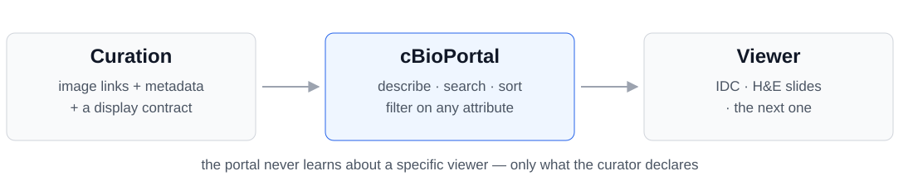

# Supporting the new slide viewer — and the next one

Ray's viewer carries far more per-image metadata than the portal could store.

So we made the portal hold **arbitrary metadata per image** — and generalized it,
so **any future viewer** can plug in the same way.

Our current example: the **ITCR set-aside project**, integrating IDC images.

---

## The example: IDC images, via the ITCR set-aside project

The images live in <strong>IDC</strong>. The descriptions live in <strong>GDC</strong>. Neither side joins them.

<strong>Ramya</strong> pulled the metadata from GDC and correlated it to the IDC slides. That correlation is what the portal curates — without it there is nothing to filter on.

---

## Before: a list of links

Every row described as "Slide Microscopy". Nothing to tell one image from another.

A researcher cannot ask <em>"show me slides with high tumor content"</em> — they can only scroll.

---

## After: every image described, sortable and filterable

Same study — 3,074 slides, 11 attributes. Filtered here to <strong>487 slides across 450 patients</strong>.

---

## How it generalizes: curation, not code

Curators declare the metadata and how each attribute behaves — display name, type, filterable, shown by default. <strong>Adding a viewer is a curation step, not an engineering project.</strong>

