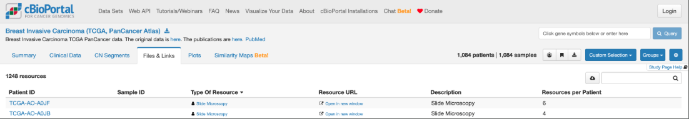
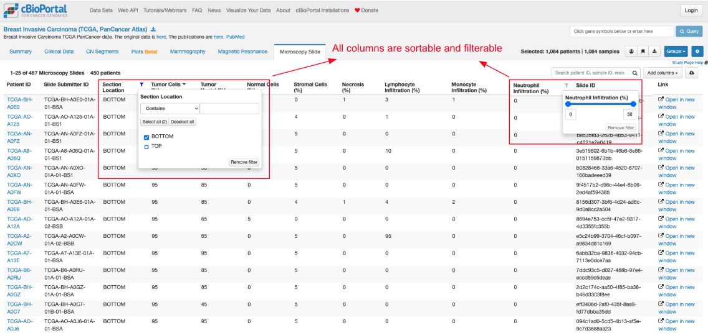
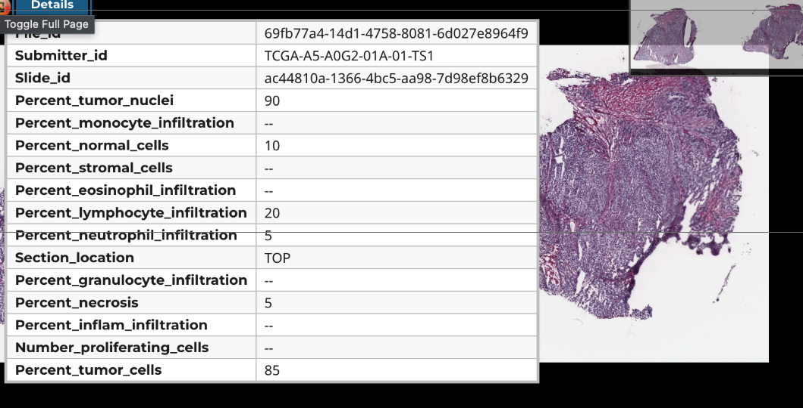

# From one viewer to many

Generalizing the H&E slide work

What Ray showed is **one viewer for one data type**.
We generalized it, so a study can bring its own images and its own viewer.

The first integration: the **IDC viewer**, from the ITCR side project.

---

## Before: a list of links

Every row described as "Slide Microscopy". Nothing to tell one image from another.

A researcher cannot ask <em>"show me slides with high tumor content"</em> — they can only scroll.

---

## After: every image described, sortable and filterable

Same study — 3,074 slides, 11 attributes. Filtered here to <strong>487 slides across 450 patients</strong>.

---

## Open it: the viewer carries its own metadata

The portal narrows it down; the IDC viewer opens on that slide with the full image detail.

Two levels of metadata: <strong>enough to find it</strong> in the portal, <strong>all of it</strong> in the viewer.

---

## How it generalizes: curation, not code

- Curators attach **metadata to each image** while curating the study
- A small **contract** declares how each attribute behaves:
  display name, description, type, filterable, shown by default
- The portal builds the table, the filters, and the viewer link

**Adding a viewer is now a curation step, not an engineering project.**

**Ramya** generated the IDC metadata that makes this possible — without it, none of the above exists.
